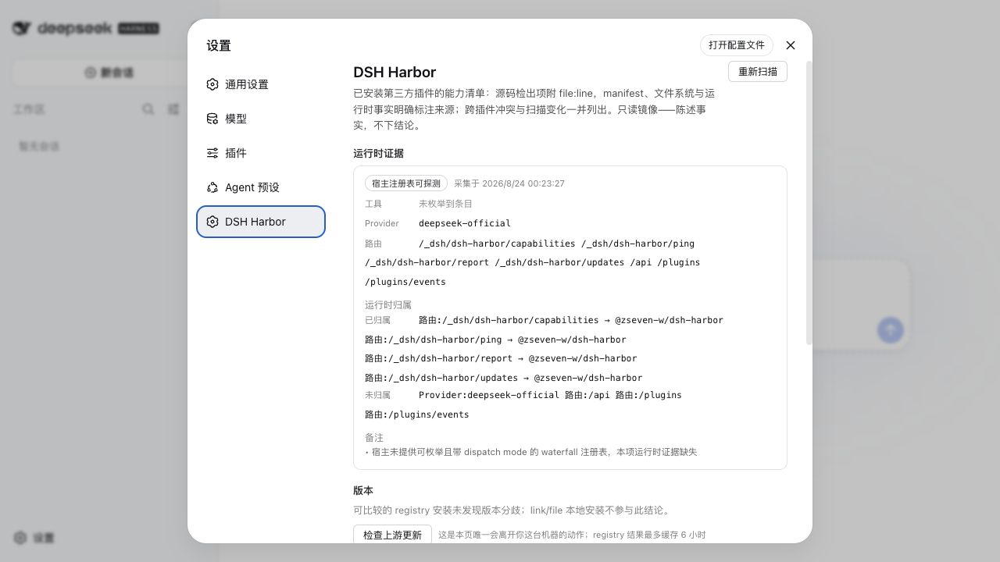
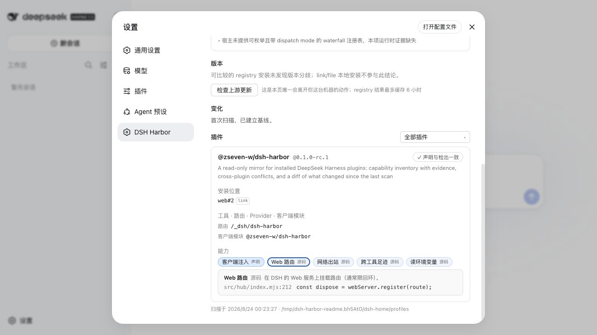

<p align="center">
  
</p>

<h1 align="center">DSH Harbor</h1>

<p align="center">
  <strong>给本机已安装 DeepSeek Harness 插件的一本证据优先事实台账。</strong><br />
  <sub>能力清单 &bull; 声明与检出对账 &bull; 运行时归属 &bull; 冲突检测 &bull; 版本漂移 &bull; 变化时间线 &bull; 升级预检</sub>
</p>

<p align="center">
  <sub>npm: <code>@zseven-w/dsh-harbor</code> &middot; 当前插件版本: <code>0.1.0-rc.3</code> &middot; 已验证 DSH <code>0.1.5-rc.2</code></sub>
</p>

<p align="center">
  <a href="./README.md">English</a> &middot; <a href="./README.zh.md"><b>简体中文</b></a> &middot; <a href="./README.zh-TW.md">繁體中文</a> &middot; <a href="./README.ja.md">日本語</a> &middot; <a href="./README.ko.md">한국어</a> &middot; <a href="./README.fr.md">Français</a> &middot; <a href="./README.es.md">Español</a> &middot; <a href="./README.de.md">Deutsch</a> &middot; <a href="./README.pt.md">Português</a> &middot; <a href="./README.ru.md">Русский</a> &middot; <a href="./README.hi.md">हिन्दी</a> &middot; <a href="./README.tr.md">Türkçe</a> &middot; <a href="./README.th.md">ไทย</a> &middot; <a href="./README.vi.md">Tiếng Việt</a> &middot; <a href="./README.id.md">Bahasa Indonesia</a>
</p>

<p align="center">
  <a href="https://github.com/ZSeven-W/dsh-harbor/actions/workflows/ci.yml"></a>
  <a href="https://github.com/ZSeven-W/dsh-harbor/blob/main/LICENSE"></a>
</p>

<br />

<p align="center">
  
</p>
<p align="center"><sub>DSH 浅色模式下的 Harbor 设置页——实时注册表、当前 profile 归属、本机版本事实与变化基线。</sub></p>

## 为什么需要 DSH Harbor

DSH 插件运行在宿主 Node realm 中，拥有与 DSH 相同的本机权限。Harbor 不用一个“风险分数”假装解决这个问题，而是维护一本只读、带证据的事实台账：装了什么、插件声明了什么、代码和实时宿主实际暴露什么、哪些插件发生冲突，以及上次扫描后发生了什么变化。

<table>
<tr>
<td width="50%">

### 🔎 能力清单

Harbor 扫描所有 DSH profile 中已安装的第三方 bundle，并使用固定的 13 项能力词表。源码结论附 `file:line`；manifest、文件系统与运行时事实会明确标注来源。

</td>
<td width="50%">

### 🤝 声明与检出对账

插件可在 `package.json` 中声明 `dsh.capabilities`。Harbor 对照声明与检出结果，列出漏声明和未知 id；格式损坏的声明会 fail-closed 为 drift，而不会拖垮整份报告。

</td>
</tr>
<tr>
<td width="50%">

### 🟢 运行时归属

在活动 DSH 宿主内，Harbor 枚举工具、Provider 与路由，并且只归属给当前 profile 实际安装的插件。宿主没有公开的注册表会显示为覆盖缺口，而不是被误解成“什么都没有”。

</td>
<td width="50%">

### ⚠️ 冲突检测

台账检查同一 profile 内的工具名、路由前缀、Provider id、客户端模块 id，以及顺序敏感的消息钩子。客户端只是引用某条路由，不会因此被误判成路由所有者。

</td>
</tr>
<tr>
<td width="50%">

### 🧭 两条版本轴

跨 profile 漂移是纯本机事实，始终离线。上游检查独立、显式、识别 registry、清除凭据，并缓存六小时。`link:` 与 `file:` 安装不会冒充 registry 最新版本。

</td>
<td width="50%">

### 🕰️ 变化时间线

快照跟踪新增、移除、版本迁移、profile 移动、能力变化与 claims 变化。即使两个制品在 profile 间互换，也会按具体 profile 报告。

</td>
</tr>
<tr>
<td width="50%">

### 🛫 升级预检

把 DSH 升到新版本之前，Harbor 先把那个精确版本装进自己的缓存目录，在子进程里逐个对已安装插件做 import 探针，把 `dsh.client.inject` 的 id 对照目标版本的客户端模块图核对，再核对宿主 peer 范围。结论按 profile 给：升级后能启动，或者起不来——被哪个插件拖崩、真实的链接期报错原文。

</td>
<td width="50%">

### 🧷 一项设置检查

唯一一条有真实升级事故的用户设置检查：内置 Agent 预设改名（DSH 0.1.2 把 `code` 改成 `ptc`）时，设置里的 `agent-presets.default` 不会迁移，之后每次新建会话都失败。预检把过期值对照目标版本的预设列表报出来。

</td>
</tr>
</table>

## 工作原理

```text
~/.dsh/profiles/*
  ├─ 已安装包与来源
  │    registry 制品 | link: 工作树 | file: 快照
  ├─ declared
  │    package.json + cordis.patch.yml
  ├─ static
  │    有界源码扫描 + file:line 证据
  ├─ runtime（在 DSH 宿主内）
  │    tools + providers + routes + 当前 profile 归属
  ├─ versions
  │    本机跨 profile 漂移 + 显式 registry 检查
  └─ snapshot
       新增 + 移除 + 版本/profile/能力/claims 变化
```

CLI 与设置面板使用同一套扫描核心。默认路径完全离线；只有 `harbor scan --check-updates`、`harbor preflight`，或面板的「检查上游更新」「升级预检」动作会联系 registry。

### 升级预检

```sh
harbor preflight --list                 # 上游 dist-tags、最近版本、本机已缓存的宿主树
harbor preflight --dsh next             # 也可以给具体版本：--dsh 0.1.5-rc.2
harbor preflight --dsh 0.1.5-rc.2 --json
```

按顺序发生的事：

1. 解析目标（dist-tag 需要一次 registry 请求），用 `npm install -g --prefix` 把 `@deepseek-ai/dsh@<version>` 装进 `<状态目录>/hosts/<version>`。装完的树会复用；全局 npm 前缀和你的 profile 永远不会被写。
2. 每个已安装第三方插件的服务端入口在一个全新的 `node` 子进程里 import 一次。`module.register` 解析钩子把 `@deepseek-ai/*` 的导入改写到目标树，插件因此链接到待评估的版本，而它自己的依赖仍从真实安装位置解析。缺包和被删的导出在链接期就失败，原文照报——DSH 加载器是 fail-loud 的，一个这样的插件就会拖崩整个 profile。
3. `dsh.client.inject` / `external` 的 id 对照目标树里声明了 web 客户端模块的包核对（DSH ≥ 0.1.5 会静默跳过未知 id，所以它自己从不报错）。宿主 peer 范围按 npm 的 prerelease 规则匹配。
4. `settings.yaml` 里的 `agent-presets.default` 对照目标版本的内置预设核对。

判决按插件（**拖崩启动** / **可加载** / **无法解析** / **未探测**）和按 profile 给出；peer 范围与死 inject 属于提示，永远不改变判决。"无法解析"指插件自己的依赖找不到，是打包问题不是宿主问题。退出码 3 表示至少一个 profile 升级后起不来。解析钩子需要 Node ≥ 20.6。

不在 profile 里的场景（CI，或者你没装过的包）可以显式指定对象：

```sh
harbor preflight --dsh next --plugin .                        # 当前仓库（先构建）
harbor preflight --dsh next --pack @scope/some-plugin@1.2.3   # 从 registry 拉取，依赖以禁脚本方式安装
```

### 两个 DSH 版本之间的契约差异

```sh
harbor host-diff --from 0.1.1-rc.2 --to 0.1.5-rc.1
```

把两个版本都装进缓存，报告插件可能依赖的所有变动：新增/删除的包、新增/删除的 web 客户端模块、内置预设，以及在子进程里 import 每个官方包入口后得到的逐包导出名增减。这是 release notes 里没有的机器可读 changelog；让插件在 0.1.5 上崩掉的 `settingsNamespace` 删除，在这里就是 `@deepseek-ai/dsh-settings` 的一条导出删除。有任何删除时退出码为 3。

### GitHub Action

插件作者可以在每个 PR 和每晚对 `next` dist-tag 跑同一套预检：

```yaml
- uses: actions/checkout@v4
- run: pnpm install --frozen-lockfile && pnpm run build   # 探测的是构建后的服务端入口
- uses: ZSeven-W/dsh-harbor@v0.1.0-rc.3
  with:
    dsh: next        # 版本或 dist-tag，默认 latest
```

插件会拖崩启动时 job 以退出码 3 失败；过期声明只告警（`fail-on-advisories: true` 可改成失败）；同时写 job summary 并上传 JSON 报告。目标宿主树按 DSH 版本缓存。

### 生态看板与发版监控

本仓库还跑两个定时 workflow：每小时检查一次 `@deepseek-ai/dsh` 的 dist-tags，任何标签移动都提交一份 `host-diff`；每晚对 npm 上所有声明了 `dsh.bundle` 或 `dsh.client` 的包（撰写时约 4,500 个）按当前 `next` 做 import 探针，增量进行——只重探 latest 版本变了的插件，DSH dist-tag 移动时才做全量。结果发布为静态页面和 `board/` 下的 JSON 索引。探测会在一次性的 CI runner 里执行每个包的模块顶层代码；这个扫描永远不会在用户机器上跑，本机预检只碰用户自己安装的插件。

## 可以直接核对的证据

<p align="center">
  
</p>
<p align="center"><sub>点击任意能力标签即可查看证据等级、细节与源码位置——图中的 Web 路由定位到 <code>src/hub/index.mjs:212</code>。</sub></p>

| 等级 | Harbor 真正知道什么 |
| --- | --- |
| `declared` | manifest 或文件系统事实，例如客户端注入、磁盘上的 realm 副本。 |
| `runtime` | 在当前 DSH 宿主注册表中实际观察到的条目。 |
| `static` | 带可核对 `file:line` 的源码行为。 |
| `heuristic` | 需要人工复核的模式推断。 |

Harbor 只陈述事实，不给风险打分。起子进程可能正是某个插件存在的全部意义；真正有用的问题是：这项能力是否可见、是否声明、能否归属、是否符合预期。

## 安装到 DSH

DSH 是独立包。如果本机尚未安装，可安装本次验证使用的版本：

```sh
npm install -g @deepseek-ai/dsh@latest
```

本地开发时，把当前 checkout 加入 Web profile，并重启一次 DSH：

```sh
dsh plugin --profile web add link:/path/to/dsh-harbor
dsh web
```

从 registry 安装时，使用候选版本的 `next` tag：

```sh
dsh plugin --profile web add @zseven-w/dsh-harbor@next
dsh web
```

打开 **设置 → DSH Harbor**。面板只会挂载在带 Web 服务的 profile 中；CLI 在 headless 与 CI 环境仍可完整使用。

### 验证安装

```sh
curl http://127.0.0.1:3080/_dsh/dsh-harbor/ping
pnpm --dir ~/.dsh/profiles/web exec harbor --version
```

健康的 ping 会报告 4 条 Harbor 路由全部挂载。可执行文件属于 profile：把插件装进 `web` 不会把 `harbor` 放进全局 shell `PATH`。

## CLI

```sh
harbor scan
harbor scan --evidence
harbor scan --json --no-snapshot
harbor scan --json --check-updates
harbor manifest ./my-plugin
harbor preflight --dsh next
```

可选运行方式：

```sh
# 已安装到 web profile
pnpm --dir ~/.dsh/profiles/web exec harbor scan

# 源码 checkout
node /path/to/dsh-harbor/src/cli.mjs scan

# 发布后一次性运行
pnpm dlx @zseven-w/dsh-harbor@next scan
```

`--help` 与 `--version` 不产生副作用。人读输出会移除不可信包元数据中的终端控制字符；JSON 保留原始机器数据。`--no-snapshot` 会阻止基线写入。

## 能力词表

| 表面 | 能力 id |
| --- | --- |
| UI 与宿主路由 | `client-injection`、`web-routes` |
| Agent 与模型表面 | `tool-registration`、`llm-adapter`、`global-hook`、`mcp-server` |
| 本机与数据访问 | `subprocess`、`network-egress`、`env-read`、`credential-handling`、`foreign-config` |
| 模块 realm 完整性 | `realm-risk`、`realm-copy` |

完整、稳定的定义与声明公约见 [SPEC.zh.md](./SPEC.zh.md)（英文版 [SPEC.md](./SPEC.md)）。插件作者可生成一份合并进现有 `dsh` 对象的 `capabilities` 成员：

```sh
harbor manifest /path/to/my-plugin
```

粘贴前必须人工核对。检测刻意保持保守且基于模式：动态调用可能漏报，示例或死代码也可能看起来像真实行为。

## 版本与快照语义

- **跨 profile 漂移**比较实际安装的 registry 制品。`link:` 工作树与 `file:` 快照保持可见，但不定义 registry 基线。
- **上游检查**读取你的 npm registry 配置，按 registry + 包名隔离缓存，从错误中清除凭据，并返回 `behind`、`current`、`ahead`、`local` 或 `unknown`。
- **快照**保存在 `~/.config/dsh-harbor/`，同时跟踪 profile membership 与制品 identity，因此 profile 互换和升级不会被去重吞掉。

## 信任模型与边界

- Harbor 是**只读镜像**，不是沙箱、安装准入或策略引擎。
- 默认扫描从不联网；上游检查是面板唯一的联网动作。
- 源码、manifest 与 freshness 读取都有上限，只接受普通文件并拒绝跟随符号链接；跳过或超限会显示为覆盖缺口。
- 当前宿主 API 无法枚举 waterfall dispatch mode，Harbor 会明确标记该运行时证据缺失，而不是猜测。
- 静态分析可能多报或漏报。证据用于复核，不用于盲目拦截。

## 开发与验证

```sh
pnpm install
pnpm run typecheck
pnpm test
pnpm run build:client
npm run smoke:pack
```

测试启动器兼容 Node 20 与 Windows。CI 覆盖 Ubuntu/Windows × Node 20/24。`smoke:pack` 会打出真实制品，在空目录用 plain npm 安装，导入公共入口，执行安装后的 CLI，并核对必需文件与权限。

## 生态

- [DSH Android](https://github.com/ZSeven-W/dsh-android) — 在会话中查看并操作 Android 模拟器或 USB 设备
- [DSH Crew](https://github.com/ZSeven-W/dsh-crew) — 从 Claude Code、Codex、Antigravity 与 Grok 派发 DSH Agent
- [DSH iOS](https://github.com/ZSeven-W/dsh-ios) — 在会话中查看并操作 iOS Simulator 或 USB 真机
- [DSH Noema](https://github.com/ZSeven-W/dsh-noema) — DSH 的持久、可检查长期记忆
- [DSH OpenPencil](https://github.com/ZSeven-W/dsh-openpencil) — 在会话中检查并编辑真实 OpenPencil 设计文档

## License

[MIT](./LICENSE) — Copyright (c) 2026 ZSeven-W
